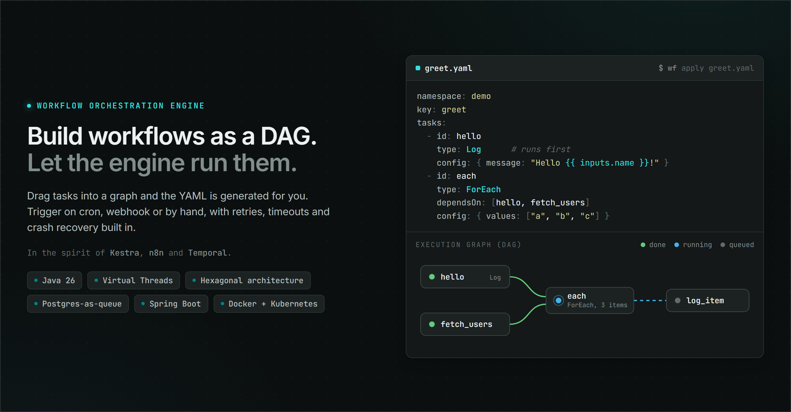

# Workflow Automation Platform



[](https://github.com/MedAfkir/workflow-automation/actions/workflows/ci.yml)

A small workflow orchestration engine in the spirit of Kestra, n8n and Temporal.
Define workflows as a DAG of tasks, trigger them on a schedule, by webhook or by hand,
and follow each execution with live logs.

## Stack

- Java 26 + Spring Boot 4, Gradle multi-module backend
- PostgreSQL as the source of truth and the work queue, Flyway migrations
- Virtual-thread workers, Pebble templating, AES-GCM secrets (env / DB / Vault)
- React + TypeScript + Vite + Tailwind frontend
- Go CLI (`wf`)

## Layout

```
core/                  domain model, execution engine, plugin SDK + built-in tasks
infrastructure/        persistence, secrets, templating, yaml adapters
applications/app-api   Spring Boot REST API
frontend/              web UI
cli/                   command-line client
deploy/                Docker + Kubernetes manifests
```

## Example workflow

You compose workflows on the canvas; the YAML below is what gets generated. Tasks run in
dependency order: a task with no `dependsOn` implicitly follows the previous one,
`dependsOn: []` opts out so it can start right away, and `dependsOn: [a, b]` waits for both.

```yaml
namespace: demo
key: greet
inputs:
  name: { type: string, default: World }
tasks:
  - id: hello                                 # runs first
    type: io.workflowplatform.builtin.Log
    config:
      message: "Hello {{ inputs.name }}!"

  - id: fetch                                 # no deps: starts right away
    type: io.workflowplatform.builtin.Http
    dependsOn: []
    config:
      url: "https://example.com/users"

  - id: each                                  # waits for hello and fetch
    type: io.workflowplatform.builtin.ForEach
    dependsOn: [hello, fetch]
    config:
      values: ["alpha", "beta", "gamma"]
      tasks:
        - id: log_item
          type: io.workflowplatform.builtin.Log
          config:
            message: "item {{ index }} = {{ value }}"
```

Built-in tasks: Log, Http, Sleep, If, ForEach, Wait, Switch. Triggers: Schedule (cron) and
Webhook. Strings are templated with Pebble, so `{{ inputs.name }}`, `{{ value }}` and
`{{ index }}` are resolved at run time.

## How it works

The API only writes rows to Postgres. A dispatcher polls for ready executions with
`SELECT ... FOR UPDATE SKIP LOCKED`, so several instances can run side by side without a
separate coordinator. Each claimed execution gets its own virtual thread, and its tasks run
in DAG order with retries and timeouts applied per task. Leases are time-bound: if a worker
dies mid-run, another one reclaims the execution and continues. Logs are persisted and
streamed to clients over Server-Sent Events.

## Getting started

Needs JDK 26, Node + pnpm, Go 1.26 and Docker.

Start Postgres (Adminer comes up on http://localhost:8081):

```
docker compose up -d
```

Run the API on http://localhost:8080:

```
./gradlew :applications:app-api:bootRun
```

Run the web UI on http://localhost:5173:

```
cd frontend
pnpm install
pnpm dev
```

## CLI

```
cd cli
go build -o wf .
./wf apply workflow.yaml
./wf logs <execution-id>
```

`wf` targets http://localhost:8080 by default; override with `--server-url` or `WF_SERVER_URL`.


## Tests

```
./gradlew build
```

Integration tests use Testcontainers, so Docker needs to be running.

## Configuration

See `applications/app-api/src/main/resources/application.yml`. Notable settings:

- `WORKFLOW_SECRET_MASTER_KEY` - base64-encoded 32-byte key for secret encryption.
  If unset, an ephemeral key is generated and DB-stored secrets won't survive a restart.
- Vault is optional and off by default (`workflow.secrets.vault.enabled`).

## Roadmap

Future tasks and ideas to implement are tracked in the [issues](https://github.com/MedAfkir/workflow-automation/issues). Feel free to pick one up.

## License

Honestly? No clue. This is a personal project I built for fun, and picking a license
turned out to be harder than writing the engine. So until I figure it out: do whatever
you want with it. Use it, fork it, learn from it, copy the bits you like, open a PR if
you feel generous. If you ship something cool with it, that already made my day.

One day I will sit down, read about MIT vs Apache vs the rest, and make it official.
Today is not that day.
